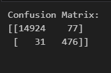
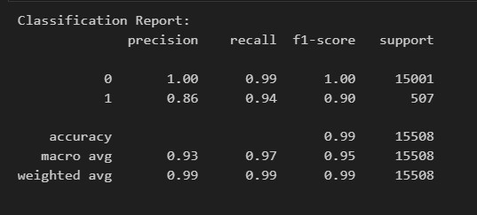

# Credit Risk Analysis Report
### Module 20

## Overview of the Analysis

* Purpose of the analysis:
    * To predict the likelihood of a loan being high-risk (defaulting), using a logistic regression model of machine learning. The dataset contains information on various loans, and the model aims to classify these loans as either healthy (0) or high-risk (1).  The intention is to be able to predict the creditworthiness of a borrower.

## Results
**Confusion Matrix**
 - 
- True Negatives (TN): 14,924 (healthy loans correctly classified)
- False Positives (FP): 77 (healthy loans incorrectly classified as high-risk)
- False Negatives (FN): 31 (high-risk loans incorrectly classified as healthy)
- True Positives (TP): 476 (high-risk loans correctly classified)

**Classification Report**
 - 
- Precision:
  - Class 0 (healthy loan): 1.00
  - Class 1 (high-risk loan): 0.86
- Recall:
  - Class 0 (healthy loan): 0.99
  - Class 1 (high-risk loan): 0.94
- F1-Score:
  - Class 0 (healthy loan): 1.00
  - Class 1 (high-risk loan): 0.90
- Support:
  - Class 0 (healthy loan): 15,001
  - Class 1 (high-risk loan): 507
    
**Overall Metrics**
  - Accuracy: 0.99
  - Macro Average:
      - Precision: 0.93
      - Recall: 0.97
      - F1-Score: 0.95
  - Weighted Average:
      - Precision: 0.99
      - Recall: 0.99
      - F1-Score: 0.99
     
**Interpretation**
 - Class 0 (healthy loan): The model performs well, with a precision, recall, and F1-score of 1.00, indicating that may perfectly identify healthy loans.
 - Class 1 (high-risk loan): The model also performs well for high-risk loans, with a precision of 0.86, recall of 0.94, and F1-score of 0.90. So, while the model is good at identifying high-risk loans, the model needs some improvement to reduce false positives.

## Summary

This logistic regression model has excellent performance in predicting healthy and high-risk loans. No scaling was required for this model as the data featrues area already on a similar scale and align with the models purpose. There was also, no significant impact to the models performance. Scaling should be carefully considered in logistic regression models where coefficient interpretations are crucial for understanding the impact of each feature on the outcome. 
Since the intention of this challenge is to predict the creditworthiness of a borrower experimenting with alternative models such as Random Forest or Isolation Forest which detect outliers, could be beneficial. These models could provide more robust predictions by identifying patterns and anomalies in the data set that simpler models might miss, thereby improving the accuracy of high-risk loan predictions.  

